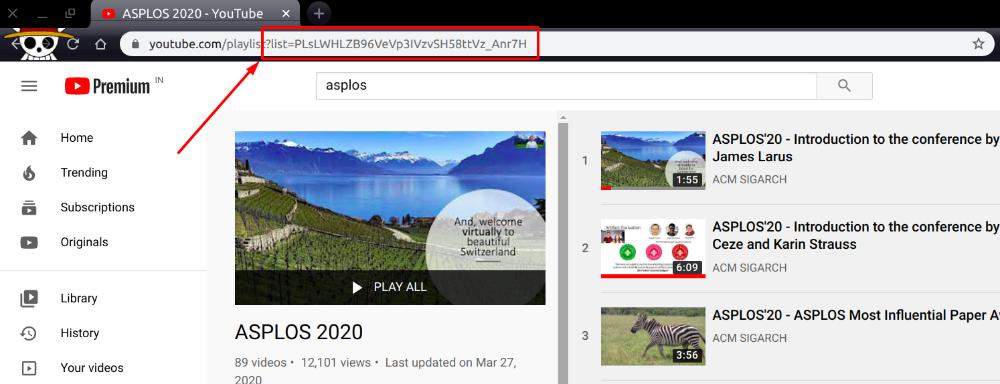

# YouTube Stats Collection
These scripts are to pull stats from different YouTube channels. Made with the purpose of getting insights at conferences going virtual (though can really easily be used for similar purposes).

Currently the scripts can:

- Collect all stats from a given playlist (`video_stats_by_playlist.py`). 

## Dependencies

- [Python YouTube](https://github.com/sns-sdks/python-youtube): A very easy to use wrapper around the YouTube Data API V3.
- Something for plotting (the library used here is matplotlib)

## Getting the API

1. Follow Step 3 from [here](https://towardsdatascience.com/tutorial-using-youtubes-annoying-data-api-in-python-part-1-9618beb0e7ea)
2. Copy the generated API key to the required location. For this repo I create a file called `api_key.dat` and read from it whenever required. You could just copy it directly to `api = pyyoutube.Api(api_key=<your_api_key>)`. 

It is important to keep this key safe. Also remember that there is per day quota for the number of requests that you can make.

## About the Scripts

#### Video stats from a playlist
`video_stats_by_playlist.py`
For this a playlist id is required for the playlist that you want to analyse. This can be found after `?list=` in the play list page. Use this id for the variable `playlist_id`. 

You can use the `count` parameter in `api.get_playlist_items(playlist_id=playlist_id, count=<number_of_videos>)` to restrict the number of videos that you want to consider.

An example plot can be seen in `images/asplos-2020.pdf`